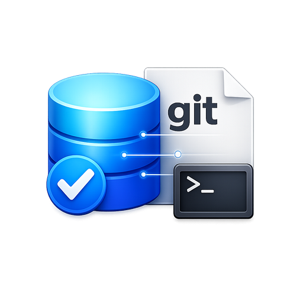

# DevReport - Git Commit History AI Summarizer

English | [简体中文](./README.md)

<div align="center">



An intelligent work report generator based on Git commit history, supporting daily, weekly, monthly reports and more.

[](https://opensource.org/licenses/MIT)
[](https://tauri.app/)
[](https://react.dev/)
[](https://www.typescriptlang.org/)

</div>

## ✨ Key Features

- 🚀 **Pure Frontend Desktop App** - Built with Tauri + React, no server required, all data stored locally
- 📊 **Multi-Project Support** - Add multiple Git projects, automatically detect submodules
- 🤖 **AI-Powered Summarization** - Connect to custom LLM APIs for professional report generation
- ⏰ **Cross-Day Statistics** - Smart time correction for commits made after midnight
- 📝 **Multiple Report Types** - Daily, weekly, monthly, quarterly, and yearly reports
- 🎨 **Modern UI** - Built with Ant Design, supports dark mode
- 🔒 **Data Security** - API keys encrypted locally, privacy guaranteed
- 💾 **Export Functionality** - Export as Markdown or copy to clipboard

## 📸 Screenshots

### Main Interface
- Project Management: Add, edit, and delete Git projects
- Report Generation: Select time range and generate reports with one click
- History: View and manage previously generated reports

### Core Features
1. **Project Configuration**
   - Add local Git repository paths
   - Automatically detect and select submodules
   - Filter commit authors (multi-select supported)
   - Independent LLM configuration

2. **Report Generation**
   - Flexible time range selection (today, yesterday, this week, this month, etc.)
   - Cross-day statistics (solves midnight commit tracking issues)
   - Real-time Git commit preview
   - Streaming report generation

3. **Global Settings**
   - Default word count configuration for reports
   - LLM parameter settings
   - Theme switching

## 🛠️ Tech Stack

- **Frontend Framework**: React 19.1 + TypeScript
- **Desktop Framework**: Tauri 2.0
- **UI Components**: Ant Design 6.3
- **Styling**: Tailwind CSS 4.2
- **State Management**: Zustand 5.0
- **Markdown Rendering**: react-markdown
- **Build Tool**: Vite 7.0

## 📦 Installation

### Download Installer

Visit the [Releases](https://github.com/YOUR_USERNAME/DevReport/releases) page to download the latest version:

- **macOS (Apple Silicon)**: `DevReport_1.0.0_aarch64.dmg`
- **macOS (Intel)**: `DevReport_1.0.0_x64.dmg`
- **Windows**: `DevReport_1.0.0_x64.msi`
- **Linux**: `DevReport_1.0.0_amd64.deb` / `DevReport_1.0.0_x86_64.AppImage`

### First Time Setup

1. Install and launch the application
2. Click "Add Project" and enter your Git repository path
3. Configure LLM API parameters (supports OpenAI, domestic LLMs, etc.)
4. Select a time range and generate your first report

## 🚀 Development Guide

### Prerequisites

- Node.js 18+ 
- Rust 1.70+
- Git 2.0+

### Local Development

```bash
# Clone the repository
git clone https://github.com/YOUR_USERNAME/DevReport.git
cd DevReport

# Install dependencies
npm install

# Start development server
npm run dev

# Build application
npm run build
```

### Project Structure

```
DevReport/
├── src/                      # Frontend source code
│   ├── components/          # React components
│   ├── pages/              # Page components
│   ├── stores/             # Zustand state management
│   ├── types/              # TypeScript type definitions
│   └── utils/              # Utility functions
├── src-tauri/              # Tauri backend
│   ├── src/               # Rust source code
│   ├── icons/             # Application icons
│   └── tauri.conf.json    # Tauri configuration
├── public/                 # Static assets
└── package.json           # Project configuration
```

## 🔧 Configuration

### LLM API Configuration

The application supports any LLM service compatible with OpenAI API format:

```json
{
  "apiKey": "your-api-key",
  "baseUrl": "https://api.openai.com/v1",
  "model": "gpt-3.5-turbo",
  "temperature": 0.7,
  "timeout": 30000
}
```

Supported providers (examples):
- OpenAI (GPT-3.5/4)
- Chinese LLMs (Qwen, ERNIE, Doubao, etc.)
- Self-hosted LLM services

### Local Storage Paths

- **macOS**: `~/Library/Application Support/com.devreport.app/`
- **Windows**: `%APPDATA%/com.devreport.app/`
- **Linux**: `~/.config/com.devreport.app/`

Stored content:
- `config.json` - Global and project configurations
- `reports/` - Historical generated reports

## 🤝 Contributing

Issues and Pull Requests are welcome!

### Development Workflow

1. Fork this repository
2. Create a feature branch (`git checkout -b feature/AmazingFeature`)
3. Commit your changes (`git commit -m 'feat: add some amazing feature'`)
4. Push to the branch (`git push origin feature/AmazingFeature`)
5. Submit a Pull Request

### Commit Convention

Follow [Conventional Commits](https://www.conventionalcommits.org/) specification:

- `feat: new feature`
- `fix: bug fix`
- `docs: documentation update`
- `style: code formatting`
- `refactor: code refactoring`
- `test: testing related`
- `chore: build/toolchain related`

## 📄 License

This project is licensed under the [MIT License](LICENSE).

## 🙏 Acknowledgments

- [Tauri](https://tauri.app/) - Excellent desktop application framework
- [React](https://react.dev/) - Powerful frontend framework
- [Ant Design](https://ant.design/) - Enterprise-level UI component library
- [Tailwind CSS](https://tailwindcss.com/) - Utility-first CSS framework

## 📮 Contact

For questions or suggestions, please:

- Submit an [Issue](https://github.com/YOUR_USERNAME/DevReport/issues)
- Email: your-email@example.com

---

**Star ⭐ this project if it helps you!**
